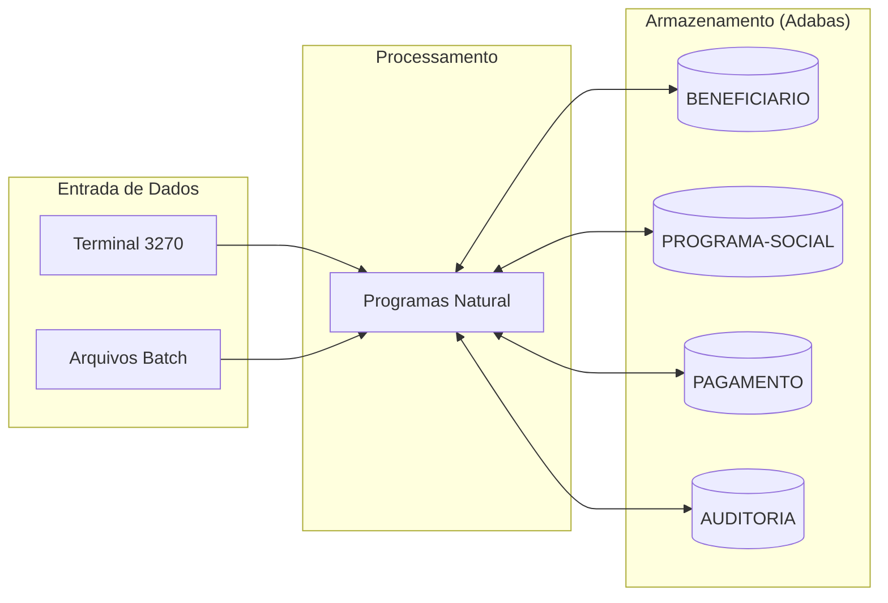

# Mapa de Dependencias - SIFAP Legado

> Use diagramas Mermaid para mapear as dependencias entre programas Natural e DDMs Adabas.
> O objetivo e visualizar "quem chama quem" e "quem le/escreve o que".

## Diagrama de Dependencias entre Programas

> Substitua o exemplo abaixo pelo mapa real do seu time.
> Dica: use `CALLNAT` e `PERFORM` no codigo para encontrar chamadas entre programas.

```mermaid
flowchart TD
 subgraph "Pair 1 · Vision"
 CADBENEF["CADBENEF.NSN"]
 CADDEPEND["CADDEPEND.NSN"]
 CADPROG["CADPROG.NSN"]
 end

 subgraph "Pair 2 · Architecture"
 BATCHPGT["BATCHPGT.NSN"]
 BATCHREL["BATCHREL.NSN"]
 BATCHCON["BATCHCON.NSN"]
 end

 subgraph "Pair 3 · Implementation"
 CALCBENF["CALCBENF.NSN"]
 CALCCORR["CALCCORR.NSN"]
 CALCDSCT["CALCDSCT.NSN"]
 end

 subgraph "Pair 4 · Quality"
 VALBENEF["VALBENEF.NSN"]
 VALDOCS["VALDOCS.NSN"]
 VALELEG["VALELEG.NSN"]
 end

 subgraph "Pair 5 · Operations"
 CONSBENF["CONSBENF.NSN"]
 RELPGT["RELPGT.NSN"]
 RELAUDIT["RELAUDIT.NSN"]
 end

 subgraph "DDMs Adabas (4/4)"
 DDM_BENEF[("BENEFICIARIO")]
 DDM_PROG[("PROGRAMA-SOCIAL")]
 DDM_PGTO[("PAGAMENTO")]
 DDM_AUD[("AUDITORIA")]
 end

 CADBENEF -->|FIND/STORE/UPDATE| DDM_BENEF
 CADDEPEND -->|FIND/UPDATE (PE DEPENDENTES)| DDM_BENEF
 CADPROG -->|FIND/STORE| DDM_PROG

 BATCHPGT -->|READ| DDM_BENEF
 BATCHPGT -->|READ| DDM_PROG
 BATCHPGT -->|READ/STORE| DDM_PGTO
 BATCHREL -->|READ| DDM_PGTO
 BATCHREL -->|FIND| DDM_BENEF
 BATCHCON -->|READ/UPDATE| DDM_PGTO
 BATCHCON -->|READ/STORE| DDM_AUD

 CALCBENF -->|FIND| DDM_BENEF
 CALCBENF -->|FIND| DDM_PROG
 CALCBENF -->|STORE| DDM_PGTO
 CALCCORR -->|READ/UPDATE| DDM_PGTO
 CALCDSCT -->|FIND| DDM_BENEF
 CALCDSCT -->|FIND/UPDATE| DDM_PGTO

 VALELEG -->|FIND| DDM_BENEF
 VALELEG -->|FIND| DDM_PROG
 CONSBENF -->|FIND/READ| DDM_BENEF
 CONSBENF -->|READ| DDM_PGTO
 RELPGT -->|READ| DDM_PGTO
 RELPGT -->|FIND| DDM_BENEF
 RELAUDIT -->|READ| DDM_AUD
```

> Consolidado com os **15 programas .NSN** e os **4 DDMs** existentes no repositório.

## Diagrama de Fluxo de Dados (DDMs)



## Tabela de Dependencias

| Programa | Chama (CALLNAT) | Le (READ) DDMs | Escreve (STORE/UPDATE) DDMs | Observacoes |
|----------|----------------|----------------|----------------------------|-------------|
| CADBENEF.NSN | Nenhum CALLNAT externo (subrotina interna `VALIDA-CPF`) | BENEFICIARIO | BENEFICIARIO | Inclusao/alteracao de beneficiario; valida CPF e status. |
| CADDEPEND.NSN | Nenhum CALLNAT externo | BENEFICIARIO | BENEFICIARIO | Atualiza grupo PE de dependentes e contador total. |
| CADPROG.NSN | Nenhum CALLNAT externo (subrotina interna `CONSULTA-PROG`) | PROGRAMA-SOCIAL | PROGRAMA-SOCIAL | Cadastro/consulta de programas sociais. |
| BATCHPGT.NSN | Nenhum CALLNAT encontrado no fonte | BENEFICIARIO, PROGRAMA-SOCIAL, PAGAMENTO | PAGAMENTO | Batch mensal; comentario de cabecalho cita dependencia funcional de `CALCBENF` e `CALCDSCT`. |
| BATCHREL.NSN | Nenhum CALLNAT externo | PAGAMENTO, BENEFICIARIO | - | Relatorio consolidado por regiao/status. |
| BATCHCON.NSN | Nenhum CALLNAT externo | PAGAMENTO, AUDITORIA | PAGAMENTO, AUDITORIA | Concilia retorno CNAB e gera trilha de auditoria. |
| CALCBENF.NSN | Nenhum CALLNAT externo | BENEFICIARIO, PROGRAMA-SOCIAL | PAGAMENTO | Calcula beneficio mensal e grava pagamento. |
| CALCCORR.NSN | Nenhum CALLNAT externo | PAGAMENTO | PAGAMENTO | Recalculo retroativo por indice de correcao. |
| CALCDSCT.NSN | Nenhum CALLNAT externo | PAGAMENTO, BENEFICIARIO | PAGAMENTO | Aplica descontos e ajusta valor liquido. |
| VALBENEF.NSN | Nenhum CALLNAT externo | - | - | Rotina de validacao cadastral em memoria (sem FIND/STORE no fonte atual). |
| VALDOCS.NSN | Nenhum CALLNAT externo | - | - | Rotina de validacao documental em memoria (sem acesso Adabas no fonte atual). |
| VALELEG.NSN | Nenhum CALLNAT externo | BENEFICIARIO, PROGRAMA-SOCIAL | - | Valida elegibilidade por status/idade/renda/regra do programa. |
| CONSBENF.NSN | Nenhum CALLNAT externo | BENEFICIARIO, PAGAMENTO | - | Consulta cadastral e historico de pagamentos. |
| RELPGT.NSN | Nenhum CALLNAT externo | PAGAMENTO, BENEFICIARIO | - | Relatorio analitico de pagamentos por periodo. |
| RELAUDIT.NSN | Nenhum CALLNAT externo | AUDITORIA | - | Relatorio de eventos de auditoria. |

## Dependencias Circulares

> Liste aqui qualquer dependencia circular encontrada (programa A chama B que chama A):

- Nao foi identificada dependencia circular por `CALLNAT` no codigo legado analisado.
- Observacao: as dependencias sao predominantemente via dados compartilhados (DDMs), nao via chamada direta entre programas.

## Programas Orfaos

> Programas que nao sao chamados por nenhum outro (possiveis pontos de entrada ou codigo morto):

- Como nao ha `CALLNAT` explicito entre os 15 programas, todos se comportam como pontos de entrada de menu, lote ou utilitarios.
- Entrada online: CADBENEF, CADDEPEND, CADPROG, CONSBENF, VALBENEF, VALDOCS, VALELEG.
- Entrada batch/relatorio: BATCHPGT, BATCHREL, BATCHCON, RELPGT, RELAUDIT, CALCBENF, CALCCORR, CALCDSCT.
