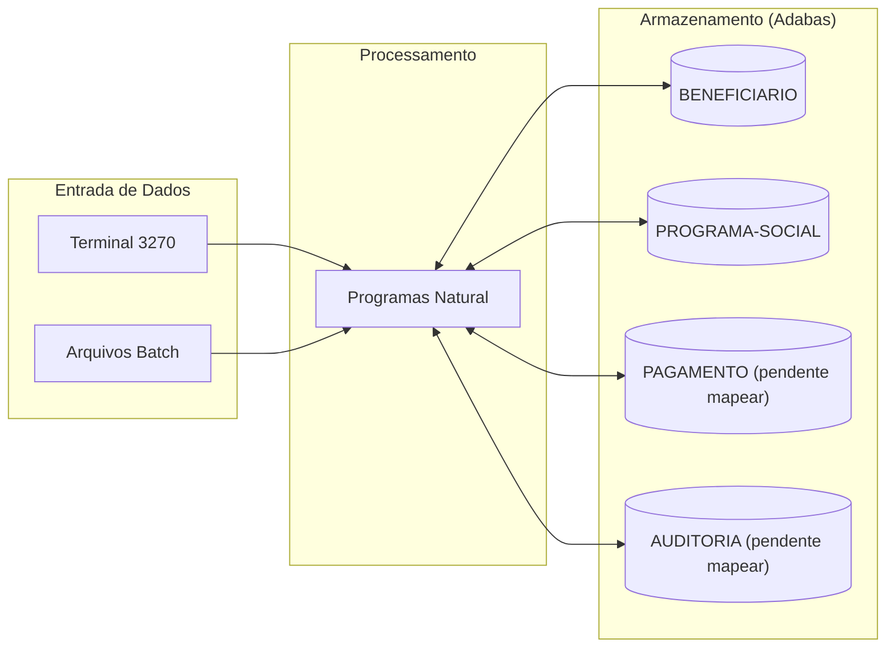

# Mapa de Dependencias - SIFAP Legado

> Use diagramas Mermaid para mapear as dependencias entre programas Natural e DDMs Adabas.
> O objetivo e visualizar "quem chama quem" e "quem le/escreve o que".

## Diagrama de Dependencias entre Programas

> Substitua o exemplo abaixo pelo mapa real do seu time.
> Dica: use `CALLNAT` e `PERFORM` no codigo para encontrar chamadas entre programas.

```mermaid
flowchart TD
 subgraph "Programas Online (Par 1 validado)"
 CADBENEF["CADBENEF.NSN<br/>Cadastro de Beneficiarios"]
 CADDEPEND["CADDEPEND.NSN<br/>Cadastro de Dependentes"]
 CADPROG["CADPROG.NSN<br/>Cadastro de Programas Sociais"]
 end

 subgraph "DDMs Adabas"
 DDM_BENEF[("DDM: BENEFICIARIO (ARQ 150)")]
 DDM_PROG[("DDM: PROGRAMA-SOCIAL (ARQ 151)")]
 end

 CADBENEF -->|FIND/STORE/UPDATE| DDM_BENEF
 CADDEPEND -->|FIND/UPDATE (PE DEPENDENTES)| DDM_BENEF
 CADPROG -->|FIND/STORE| DDM_PROG
```

> **Instrucao**: Este e apenas um exemplo inicial com 6 programas.
> Seu time deve mapear **todos os 15 programas** e **4 DDMs**.

## Diagrama de Fluxo de Dados (DDMs)



> Substitua "DDM 3: ???" e "DDM 4: ???" pelos nomes reais encontrados.

## Tabela de Dependencias

| Programa | Chama (CALLNAT) | Le (READ) DDMs | Escreve (STORE/UPDATE) DDMs | Observacoes |
|----------|----------------|----------------|----------------------------|-------------|
| CADBENEF.NSN | Nenhum CALLNAT externo (usa subrotina interna `VALIDA-CPF`) | BENEFICIARIO | BENEFICIARIO | Valida CPF (Mod-11), inclui/altera titular, aplica regra etaria (>75). |
| CADDEPEND.NSN | Nenhum CALLNAT externo | BENEFICIARIO | BENEFICIARIO | Atualiza grupo periodico de dependentes e contador `NUM-DEPENDENTES`. |
| CADPROG.NSN | Nenhum CALLNAT externo (usa subrotina interna `CONSULTA-PROG`) | PROGRAMA-SOCIAL | PROGRAMA-SOCIAL | Inclui/consulta programas e recalcula valor-base por fator K. |
| BATCHPGT.NSN | A mapear pelo Par 2 | A mapear | A mapear | Pendente handoff cruzado. |
| BATCHREL.NSN | A mapear pelo Par 2 | A mapear | A mapear | Pendente handoff cruzado. |
| BATCHCON.NSN | A mapear pelo Par 2 | A mapear | A mapear | Pendente handoff cruzado. |
| CALCBENF.NSN | A mapear pelo Par 3 | A mapear | A mapear | Pendente handoff cruzado. |
| CALCCORR.NSN | A mapear pelo Par 3 | A mapear | A mapear | Pendente handoff cruzado. |
| CALCDSCT.NSN | A mapear pelo Par 3 | A mapear | A mapear | Pendente handoff cruzado. |
| VALBENEF.NSN | A mapear pelo Par 4 | A mapear | A mapear | Pendente handoff cruzado. |
| VALDOCS.NSN | A mapear pelo Par 4 | A mapear | A mapear | Pendente handoff cruzado. |
| VALELEG.NSN | A mapear pelo Par 4 | A mapear | A mapear | Pendente handoff cruzado. |
| CONSBENF.NSN | A mapear pelo Par 5 | A mapear | A mapear | Pendente handoff cruzado. |
| RELPGT.NSN | A mapear pelo Par 5 | A mapear | A mapear | Pendente handoff cruzado. |
| RELAUDIT.NSN | A mapear pelo Par 5 | A mapear | A mapear | Pendente handoff cruzado. |

## Dependencias Circulares

> Liste aqui qualquer dependencia circular encontrada (programa A chama B que chama A):

- Nenhuma dependencia circular identificada no recorte do Par 1.

## Programas Orfaos

> Programas que nao sao chamados por nenhum outro (possiveis pontos de entrada ou codigo morto):

- Nenhum programa orfao identificado no recorte do Par 1; mapa completo depende consolidacao dos demais pares.
