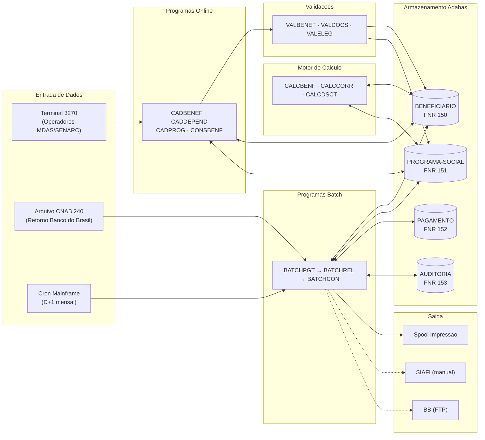
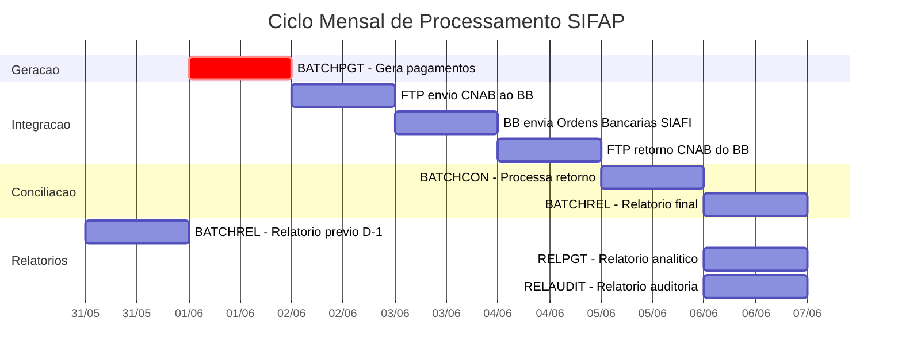
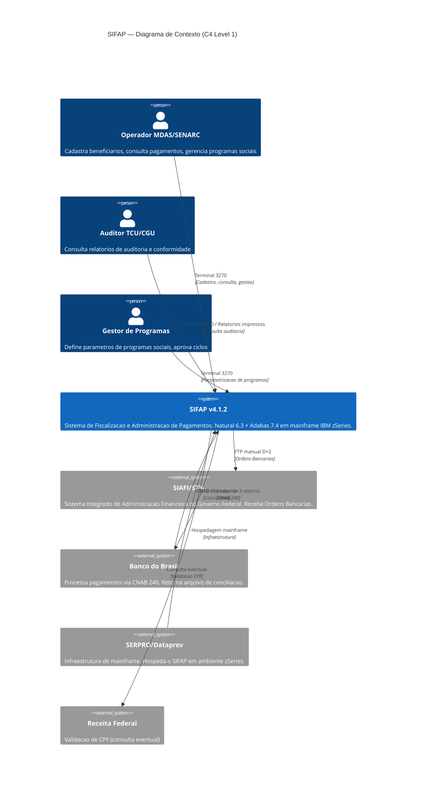

# Mapa de Dependencias - SIFAP Legado

> Mapeamento completo de dependencias entre os 15 programas Natural e 4 DDMs Adabas.
> Objetivo: visualizar "quem chama quem" e "quem le/escreve o que".

**Preenchido por:** Par 2 — Fabio Guerra (Enterprise Architect + Software Architect) — Team-02-VerdeDanadinho

---

## Diagrama de Dependencias entre Programas

```mermaid
flowchart TD
  subgraph "Programas Online (Terminal 3270)"
    CADBENEF["CADBENEF.NSN<br/>Cadastro de Beneficiarios"]
    CADDEPEND["CADDEPEND.NSN<br/>Cadastro de Dependentes"]
    CADPROG["CADPROG.NSN<br/>Cadastro de Programas Sociais"]
    CONSBENF["CONSBENF.NSN<br/>Consulta de Beneficiarios"]
  end

  subgraph "Programas Batch (Execucao Mensal)"
    BATCHPGT["BATCHPGT.NSN<br/>Geracao de Pagamentos<br/>★ Critico - D+1"]
    BATCHREL["BATCHREL.NSN<br/>Relatorios Consolidados<br/>D-1 e D+5"]
    BATCHCON["BATCHCON.NSN<br/>Conciliacao Bancaria<br/>D+4"]
  end

  subgraph "Motor de Calculo"
    CALCBENF["CALCBENF.NSN<br/>Calculo de Beneficios<br/>~4800 linhas"]
    CALCCORR["CALCCORR.NSN<br/>Correcao Retroativa IPCA"]
    CALCDSCT["CALCDSCT.NSN<br/>Calculo de Descontos"]
  end

  subgraph "Validacoes"
    VALBENEF["VALBENEF.NSN<br/>Validacao de Beneficiarios"]
    VALDOCS["VALDOCS.NSN<br/>Validacao de Documentos"]
    VALELEG["VALELEG.NSN<br/>Validacao de Elegibilidade"]
  end

  subgraph "Relatorios e Auditoria"
    RELPGT["RELPGT.NSN<br/>Relatorio Analitico Pagamentos"]
    RELAUDIT["RELAUDIT.NSN<br/>Relatorio de Auditoria"]
  end

  subgraph "DDMs Adabas"
    DDM_BENEF[("BENEFICIARIO<br/>FNR 150<br/>~4.2M registros")]
    DDM_PROG[("PROGRAMA-SOCIAL<br/>FNR 151<br/>~45 registros")]
    DDM_PGTO[("PAGAMENTO<br/>FNR 152<br/>~180M registros")]
    DDM_AUDIT[("AUDITORIA<br/>FNR 153<br/>~25M registros")]
  end

  subgraph "Sistemas Externos"
    SIAFI["SIAFI/STN<br/>(Integracao indireta)"]
    BB["Banco do Brasil<br/>CNAB 240"]
    SPOOL["Spool Impressao<br/>Mainframe"]
  end

  %% === CHAMADAS ENTRE PROGRAMAS ===
  BATCHPGT -.->|"cabecalho diz CALLNAT<br/>mas NAO chama (MYSTERY-1)"| CALCBENF
  BATCHPGT -.->|"cabecalho diz CALLNAT<br/>mas NAO chama (MYSTERY-1)"| CALCDSCT
  CALCBENF -->|"CALC-DESCONTOS<br/>(logica interna)"| CALCDSCT
  CADBENEF -->|"VALIDA-CPF<br/>(sub-rotina interna)"| VALBENEF
  CADDEPEND -->|"VINCULACAO-BENEF<br/>(sub-rotina interna)"| CADBENEF
  VALBENEF -->|"gate de elegibilidade"| VALELEG

  %% === ACESSOS A DDMs — BENEFICIARIO (150) ===
  CADBENEF -->|"READ/STORE"| DDM_BENEF
  CADDEPEND -->|"READ/UPDATE"| DDM_BENEF
  CONSBENF -->|"READ"| DDM_BENEF
  BATCHPGT -->|"READ BY CPF"| DDM_BENEF
  BATCHREL -->|"FIND BY CPF"| DDM_BENEF
  CALCBENF -->|"READ"| DDM_BENEF
  VALBENEF -->|"READ"| DDM_BENEF
  VALDOCS -->|"READ"| DDM_BENEF
  VALELEG -->|"READ"| DDM_BENEF
  RELPGT -->|"READ"| DDM_BENEF

  %% === ACESSOS A DDMs — PROGRAMA-SOCIAL (151) ===
  CADPROG -->|"READ/STORE"| DDM_PROG
  BATCHPGT -->|"FIND"| DDM_PROG
  CALCBENF -->|"READ"| DDM_PROG
  VALELEG -->|"READ"| DDM_PROG

  %% === ACESSOS A DDMs — PAGAMENTO (152) ===
  BATCHPGT -->|"READ DESC/FIND/STORE"| DDM_PGTO
  BATCHREL -->|"READ BY COMPETENCIA"| DDM_PGTO
  BATCHCON -->|"FIND/UPDATE"| DDM_PGTO
  CONSBENF -->|"READ"| DDM_PGTO
  RELPGT -->|"READ"| DDM_PGTO

  %% === ACESSOS A DDMs — AUDITORIA (153) ===
  BATCHCON -->|"READ DESC/STORE"| DDM_AUDIT
  RELAUDIT -->|"READ"| DDM_AUDIT
  CADPROG -->|"STORE"| DDM_AUDIT

  %% === INTEGRACOES EXTERNAS ===
  BB -->|"Retorno CNAB 240<br/>FTP D+3"| BATCHCON
  BATCHREL -->|"Flat file 132 col"| SPOOL
  RELPGT -->|"Flat file 132 col"| SPOOL
  RELAUDIT -->|"Flat file 132 col"| SPOOL
  BATCHCON -.->|"Fluxo manual D+2<br/>via Ordens Bancarias"| SIAFI
```



## Diagrama de Fluxo de Dados (DDMs)



## Fluxo Temporal Batch (Ciclo Mensal)



## Tabela de Dependencias

| Programa | Tipo | Chama (CALLNAT/PERFORM) | Le (READ/FIND) DDMs | Escreve (STORE/UPDATE) DDMs | Observacoes |
|----------|------|-------------------------|----------------------|----------------------------|-------------|
| CADBENEF.NSN | Online | VALIDA-CPF (interna) | BENEFICIARIO (150) | BENEFICIARIO (150) | Cadastro com validacao CPF |
| CADDEPEND.NSN | Online | VINCULACAO-BENEF (interna) | BENEFICIARIO (150) | BENEFICIARIO (150) | Vincula dependentes ao titular |
| CADPROG.NSN | Online | CONSULTA-PROG (interna) | PROGRAMA-SOCIAL (151) | PROGRAMA-SOCIAL (151), AUDITORIA (153) | Gestao de programas sociais |
| CONSBENF.NSN | Online | MASCARA-CPF (interna) | BENEFICIARIO (150), PAGAMENTO (152) | — | Consulta read-only com historico |
| BATCHPGT.NSN | Batch | DET-FAIXA-RENDA (interna) | BENEFICIARIO (150), PROGRAMA-SOCIAL (151), PAGAMENTO (152) | PAGAMENTO (152) | ★ God Batch — calculo inline (nao chama CALCBENF apesar do cabecalho) |
| BATCHREL.NSN | Batch | IMPRIME-CABECALHO (interna) | PAGAMENTO (152), BENEFICIARIO (150) | — | Relatorio 132 col, arredondamento divergente |
| BATCHCON.NSN | Batch | GRAVA-AUDITORIA (interna) | PAGAMENTO (152), AUDITORIA (153) | PAGAMENTO (152), AUDITORIA (153) | Conciliacao CNAB 240 BB |
| CALCBENF.NSN | Calculo | CALC-DESCONTOS (interna) | BENEFICIARIO (150), PROGRAMA-SOCIAL (151) | — | Motor principal ~4800 linhas |
| CALCCORR.NSN | Calculo | CALC-INDICE-ACUM (interna) | PAGAMENTO (152) | PAGAMENTO (152) | Correcao retroativa IPCA |
| CALCDSCT.NSN | Calculo | — | BENEFICIARIO (150) | — | Descontos: IR, judicial, consignacoes (8 tipos) |
| VALBENEF.NSN | Validacao | VALIDA-CPF-COMPLETO, VALIDA-DATA, VALIDA-NOME (internas) | BENEFICIARIO (150) | — | Validacao de dados cadastrais |
| VALDOCS.NSN | Validacao | VALIDA-CPF-DOC, VALIDA-RG, CHECK-DOC-ESPECIAL (internas) | BENEFICIARIO (150) | — | Validacao documental |
| VALELEG.NSN | Validacao | VERIF-ELEG-ESPECIFICA (interna) | BENEFICIARIO (150), PROGRAMA-SOCIAL (151) | — | Elegibilidade vs regras do programa |
| RELPGT.NSN | Relatorio | IMPRIME-SUBTOTAL, IMPRIME-CABECALHO (internas) | BENEFICIARIO (150), PAGAMENTO (152) | — | Relatorio analitico paginado |
| RELAUDIT.NSN | Relatorio | IMPRIME-CAB-AUDIT (interna) | AUDITORIA (153) | — | Relatorio de auditoria por periodo/acao |

## Mapa de Acesso DDM (Quem acessa o que)

| DDM | FNR | Programas que LEEM | Programas que ESCREVEM | Hotspot |
|-----|-----|--------------------|------------------------|---------|
| BENEFICIARIO | 150 | CADBENEF, CADDEPEND, CONSBENF, BATCHPGT, BATCHREL, CALCBENF, CALCDSCT, VALBENEF, VALDOCS, VALELEG, RELPGT (11 programas) | CADBENEF, CADDEPEND (2 programas) | ★★★ Mais acessado — 11 leitores |
| PROGRAMA-SOCIAL | 151 | CADPROG, BATCHPGT, CALCBENF, VALELEG (4 programas) | CADPROG (1 programa) | ★ Baixo acoplamento |
| PAGAMENTO | 152 | BATCHPGT, BATCHREL, BATCHCON, CONSBENF, CALCCORR, RELPGT (6 programas) | BATCHPGT, BATCHCON, CALCCORR (3 programas) | ★★ Alto volume (~180M registros) |
| AUDITORIA | 153 | BATCHCON, RELAUDIT (2 programas) | BATCHCON, CADPROG (2 programas) | ★ Append-only |

## Dependencias Circulares

Nenhuma dependencia circular direta encontrada. O fluxo e estritamente:

```
Cadastro (Online) → Calculo (Batch) → Pagamento (Batch) → Conciliacao (Batch) → Relatorios
```

**Risco potencial:** BATCHPGT replica logica do CALCBENF inline em vez de chama-lo (MYSTERY-1), criando **duplicacao de regras de negocio** que pode divergir silenciosamente.

## Diagrama C4 — Level 1: Contexto de Sistema



> Liste aqui qualquer dependencia circular encontrada (programa A chama B que chama A):

- Nenhuma encontrada ate agora.

## Programas Orfaos

> Programas que nao sao chamados por nenhum outro (possiveis pontos de entrada ou codigo morto):

- A investigar.
