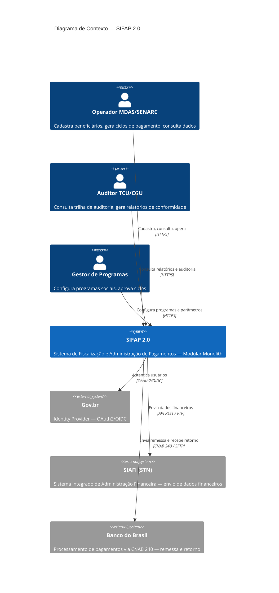

# Especificação Técnica — SIFAP 2.0

**Time**: Team-02-VerdeDanadinho
**Data**: 20/05/2026
**Status**: Draft
**Versão**: 1.0.0

---

## 1. Visão Geral

O SIFAP 2.0 (Sistema de Fiscalização e Administração de Pagamentos) é a modernização do sistema legado homônimo, em produção desde 1997 sobre mainframe IBM zSeries com Natural 6.3 + Adabas 7.4. O sistema gerencia o ciclo completo de pagamentos de benefícios federais (MDAS/SENARC) para aproximadamente 4,2 milhões de beneficiários ativos.

### 1.1 Escopo da Modernização

A modernização abrange 15 programas Natural (.NSN), 4 DDMs Adabas e ~210 milhões de registros. A estratégia adotada é **Modular Monolith com Strangler Fig** (ADR-001), permitindo migração incremental sem downtime.

O sistema é decomposto em **7 bounded contexts**: Cadastro, Cálculo, Pagamento, Conciliação, Relatório, Auditoria e Identidade (greenfield). A migração de dados segue abordagem incremental com dual-write temporário (ADR-002), e a autenticação é via Gov.br OAuth2/OIDC (ADR-003).

### 1.2 Stack de Destino

| Camada | Tecnologia |
|--------|-----------|
| Backend | Java 21 + Spring Boot 3.3 + JPA/Hibernate + PostgreSQL 16 |
| Frontend | Next.js 15 (App Router) + TypeScript 5 (strict) + Tailwind CSS + shadcn/ui |
| Processamento Batch | Spring Batch (chunk processing com idempotência) |
| Cache | Redis (opcional, para sessões e fatores de cálculo) |
| Autenticação | OAuth2/OIDC via Gov.br + Spring Security |
| IaC | Terraform (Azure provider) |
| CI/CD | GitHub Actions |
| Testes | JUnit 5 + Testcontainers (backend); Vitest + Testing Library (frontend) |

### 1.3 Programas Legados Cobertos

| Programa | Tipo | Bounded Context Destino |
|----------|------|------------------------|
| CADBENEF.NSN | Online (cadastro) | Cadastro |
| CADDEPEND.NSN | Online (cadastro) | Cadastro |
| CADPROG.NSN | Online (cadastro) | Cadastro |
| VALBENEF.NSN | Validação | Cadastro |
| VALDOCS.NSN | Validação | Cadastro |
| VALELEG.NSN | Validação | Cadastro + Cálculo |
| CALCBENF.NSN | Cálculo | Cálculo |
| CALCCORR.NSN | Cálculo | Cálculo |
| CALCDSCT.NSN | Cálculo | Cálculo |
| BATCHPGT.NSN | Batch (pagamento) | Pagamento |
| BATCHCON.NSN | Batch (conciliação) | Conciliação |
| BATCHREL.NSN | Batch (relatório) | Relatório |
| CONSBENF.NSN | Online (consulta) | Relatório |
| RELPGT.NSN | Relatório | Relatório |
| RELAUDIT.NSN | Relatório | Auditoria |

---

## 2. Requisitos Funcionais (EARS)

> Cada requisito segue um dos 6 padrões EARS (Easy Approach to Requirements Syntax):
> Ubiquitous, Event-Driven, State-Driven, Optional, Unwanted Behavior, Complex.
>
> Campos obrigatórios: REQ-ID, sentença EARS, `source_legacy:`, `acceptance_criteria:`, `priority:`.

---

### 2.1 Cadastro (`cadastro`)

#### REQ-CAD-001 — Validação de CPF por Módulo-11

**Padrão EARS**: Event-Driven

> When um beneficiário é cadastrado ou alterado, the SIFAP shall validar o CPF utilizando o algoritmo Módulo-11 com dois dígitos verificadores conforme padrão da Receita Federal.

- `source_legacy:` `legacy/natural-programs/CADBENEF.NSN#L105-L116`, `legacy/natural-programs/CADBENEF.NSN#L224-L270`, `legacy/natural-programs/VALBENEF.NSN#L205-L238`
- `acceptance_criteria:`
  1. CPF com dígitos verificadores inválidos retorna erro 400 com mensagem "CPF inválido"
  2. CPF com todos os 11 dígitos iguais (ex.: 111.111.111-11) é rejeitado
  3. CPF válido (ex.: 529.982.247-25) é aceito e persiste no cadastro
- `priority:` Alta

---

#### REQ-CAD-002 — Rejeição de CPF Duplicado na Inclusão

**Padrão EARS**: Unwanted Behavior

> The SIFAP shall not permitir a inclusão de um beneficiário quando já existe um registro com o mesmo CPF na base de dados.

- `source_legacy:` `legacy/natural-programs/CADBENEF.NSN#L137-L147`
- `acceptance_criteria:`
  1. Tentativa de incluir CPF já existente retorna erro 409 (Conflict)
  2. Mensagem de erro indica "CPF já cadastrado no sistema"
  3. Nenhum registro duplicado é criado no banco de dados
- `priority:` Alta

---

#### REQ-CAD-003 — Alteração Somente de CPF Existente

**Padrão EARS**: Event-Driven

> When uma operação de alteração é solicitada para um CPF, the SIFAP shall verificar a existência prévia do registro e rejeitar com erro 404 caso não encontrado.

- `source_legacy:` `legacy/natural-programs/CADBENEF.NSN#L149-L153`
- `acceptance_criteria:`
  1. Alteração de CPF inexistente retorna erro 404 (Not Found)
  2. Alteração de CPF existente atualiza os dados e retorna 200 (OK)
  3. Campo `DT-ATUALIZACAO` é atualizado com timestamp UTC
- `priority:` Alta

---

#### REQ-CAD-004 — Status Inicial de Beneficiário como Ativo

**Padrão EARS**: Event-Driven

> When um beneficiário é incluído no sistema, the SIFAP shall atribuir status inicial `ATIVO` e registrar `DT-CADASTRO` e `DT-ATUALIZACAO` com a data/hora corrente em UTC.

- `source_legacy:` `legacy/natural-programs/CADBENEF.NSN#L162-L164`, `legacy/natural-programs/CADBENEF.NSN#L193-L199`
- `acceptance_criteria:`
  1. Novo beneficiário tem status `ATIVO` na resposta da API
  2. `DT-CADASTRO` e `DT-ATUALIZACAO` são idênticos e em UTC
  3. Status persiste corretamente no banco de dados
- `priority:` Alta

---

#### REQ-CAD-005 — Suspensão Automática por Idade Superior a 75 Anos

**Padrão EARS**: Complex

> While um beneficiário possui idade superior a 75 anos (calculada pela data de nascimento com precisão de dia), when o cadastro é incluído ou atualizado, the SIFAP shall alterar o status para `SUSPENSO` automaticamente, sobrescrevendo o status inicial, e registrar o motivo na trilha de auditoria.

- `source_legacy:` `legacy/natural-programs/CADBENEF.NSN#L156-L169`
- `acceptance_criteria:`
  1. Beneficiário com 76 anos cadastrado recebe status `SUSPENSO`
  2. Beneficiário com 74 anos cadastrado mantém status `ATIVO`
  3. Cálculo de idade usa `java.time.LocalDate` com precisão de dia (corrigindo BR-PGT-19 que ignora mês/dia)
- `priority:` Alta

---

#### REQ-CAD-006 — Bloqueio de Inclusão de Dependente para Titular Cancelado/Desligado

**Padrão EARS**: Unwanted Behavior

> The SIFAP shall not permitir a inclusão de dependentes para beneficiários com status `CANCELADO` ou `DESLIGADO`.

- `source_legacy:` `legacy/natural-programs/CADDEPEND.NSN#L56-L60`
- `acceptance_criteria:`
  1. Inclusão de dependente para titular com status `CANCELADO` retorna erro 422
  2. Inclusão de dependente para titular com status `DESLIGADO` retorna erro 422
  3. Inclusão de dependente para titular com status `ATIVO` é aceita normalmente
- `priority:` Alta

---

#### REQ-CAD-007 — Limite de Dependentes por Titular

**Padrão EARS**: Unwanted Behavior

> The SIFAP shall not permitir mais de 10 dependentes por beneficiário titular, retornando erro com mensagem explicativa quando o limite for atingido.

- `source_legacy:` `legacy/natural-programs/CADDEPEND.NSN#L63-L66`, `legacy/adabas-ddms/BENEFICIARIO.ddm`
- `acceptance_criteria:`
  1. Inclusão do 11º dependente retorna erro 422 com mensagem "Limite de 10 dependentes atingido"
  2. Inclusão do 10º dependente é aceita normalmente
  3. Contagem de dependentes é consistente entre API e banco de dados
- `priority:` Media

---

#### REQ-CAD-008 — Unicidade de CPF de Dependente por Titular

**Padrão EARS**: Unwanted Behavior

> The SIFAP shall not permitir CPFs duplicados entre os dependentes de um mesmo beneficiário titular.

- `source_legacy:` `legacy/natural-programs/CADDEPEND.NSN#L96-L101`
- `acceptance_criteria:`
  1. Inclusão de dependente com CPF já vinculado ao mesmo titular retorna erro 409
  2. Mesmo CPF vinculado a titulares diferentes é aceito
  3. Dependente sem CPF informado (campo opcional) não é validado por unicidade
- `priority:` Alta

---

#### REQ-CAD-009 — Remoção do Backdoor CHECK-DOC-ESPECIAL

**Padrão EARS**: Unwanted Behavior

> The SIFAP shall not aceitar CPFs com prefixos especiais (000, 001, 002, 010, 011, 099, 100, 999) como válidos sem verificação completa de documentos. Todos os CPFs devem passar pela validação Módulo-11 sem exceção.

- `source_legacy:` `legacy/natural-programs/VALDOCS.NSN#L49-L56`, `legacy/natural-programs/VALDOCS.NSN#L166-L182`
- `acceptance_criteria:`
  1. CPF com prefixo 000 é validado pelo algoritmo Módulo-11 como qualquer outro
  2. Nenhuma sub-rotina de bypass de validação existe no código moderno
  3. Teste de segurança confirma que nenhum CPF especial escapa da validação
- `priority:` Alta

---

#### REQ-CAD-010 — Remoção do Backdoor CPF Prefixo 000 "TESTE GOVERNO"

**Padrão EARS**: Unwanted Behavior

> The SIFAP shall not aceitar CPFs com prefixo 000 e dígitos todos iguais como "TESTE GOVERNO". CPFs com todos os 11 dígitos iguais devem ser rejeitados sem exceção.

- `source_legacy:` `legacy/natural-programs/VALBENEF.NSN#L196-L200`
- `acceptance_criteria:`
  1. CPF 000.000.000-00 é rejeitado com erro 400
  2. CPF 111.111.111-11 é rejeitado com erro 400
  3. Nenhuma exceção para prefixos de teste existe no sistema
- `priority:` Alta

---

#### REQ-CAD-011 — Validação de Data de Nascimento com Bissexto Correto

**Padrão EARS**: Event-Driven

> When uma data de nascimento é informada no cadastro, the SIFAP shall validar o formato (AAAA-MM-DD), o intervalo (1900 até data corrente), e a validade do dia considerando corretamente anos bissextos.

- `source_legacy:` `legacy/natural-programs/VALBENEF.NSN#L242-L258`, `legacy/natural-programs/VALBENEF.NSN#L96`
- `acceptance_criteria:`
  1. Data 29/02/2024 (ano bissexto) é aceita
  2. Data 29/02/2023 (ano não-bissexto) é rejeitada
  3. Data anterior a 01/01/1900 é rejeitada
- `priority:` Media

---

#### REQ-CAD-012 — Campos Obrigatórios do Cadastro

**Padrão EARS**: Ubiquitous

> The SIFAP shall exigir CPF, nome completo (com pelo menos um espaço separando nome e sobrenome), data de nascimento e sexo como campos obrigatórios no cadastro de beneficiário.

- `source_legacy:` `legacy/natural-programs/CADBENEF.NSN#L105-L135`, `legacy/natural-programs/VALBENEF.NSN#L262-L277`
- `acceptance_criteria:`
  1. Cadastro sem CPF retorna erro 400 listando campo faltante
  2. Nome sem sobrenome (sem espaço) retorna erro 400
  3. Todos os 4 campos preenchidos corretamente permite a inclusão
- `priority:` Alta

---

#### REQ-CAD-013 — Gestão de Programas Sociais com Fator-K

**Padrão EARS**: Event-Driven

> When um programa social é cadastrado, the SIFAP shall calcular o valor-base persistido utilizando a fórmula `FATOR-K = 1 + (FATOR-REAJUSTE × 0.347215)` e atribuir status inicial `ATIVO`.

- `source_legacy:` `legacy/natural-programs/CADPROG.NSN#L87-L103`
- `acceptance_criteria:`
  1. Programa com FATOR-REAJUSTE = 0.10 resulta em FATOR-K = 1.0347215
  2. Status inicial do programa é `ATIVO`
  3. Cálculo usa `BigDecimal` com `RoundingMode.HALF_EVEN` para precisão
- `priority:` Media

---

#### REQ-CAD-014 — Parametrização do Limiar de Renda R$600

**Padrão EARS**: Ubiquitous

> The SIFAP shall armazenar o limiar de renda para elegibilidade de programas tipo Assistencial (atualmente R$600,00) como parâmetro configurável na tabela de programas sociais, e não como valor hardcoded.

- `source_legacy:` `legacy/natural-programs/VALELEG.NSN#L169-L182`
- `acceptance_criteria:`
  1. Limiar de renda é lido da tabela `parametro_programa` a cada verificação de elegibilidade
  2. Alteração do limiar via API de configuração reflete imediatamente nas validações
  3. Valor padrão na migração inicial é R$600,00
- `priority:` Alta

---

### 2.2 Cálculo (`calculo`)

#### REQ-CALC-001 — Fórmula Principal de Benefício com 4 Fatores

**Padrão EARS**: Event-Driven

> When o cálculo de benefício é executado para uma competência, the SIFAP shall aplicar a fórmula composta `VLR_BENF = VLR_BASE × FatorRegional × FatorFamiliar × FatorRenda × FatorIdade × (1 + FATOR_REAJUSTE)` utilizando `BigDecimal` com `RoundingMode.HALF_EVEN`.

- `source_legacy:` `legacy/natural-programs/CALCBENF.NSN#L195-L197`, `legacy/natural-programs/BATCHPGT.NSN#L279-L282`
- `acceptance_criteria:`
  1. VLR_BASE=1000, FatorReg=1.20, FatorFam=1.10, FatorRenda=0.85, FatorIdade=1.15, Reajuste=0.05 → resultado calculado com precisão de 2 casas decimais
  2. Todos os fatores são lidos de tabelas configuráveis (não hardcoded)
  3. Cálculo usa CALCBENF completo (4 fatores) como referência canônica, não a versão inline simplificada do BATCHPGT
- `priority:` Alta

---

#### REQ-CALC-002 — Tabela de Fatores Regionais Configurável

**Padrão EARS**: Ubiquitous

> The SIFAP shall armazenar os 27 fatores regionais (variação de 1.00 a 1.40) em tabela configurável `fator_regional` no schema `calculo`, com código de região e fator multiplicador, incluindo a Região 99 (Internacional/Diplomático) com fator 1.00.

- `source_legacy:` `legacy/natural-programs/CALCBENF.NSN#L78-L103`, `legacy/natural-programs/BATCHPGT.NSN#L123-L150`
- `acceptance_criteria:`
  1. Tabela contém 28 registros (regiões 1-27 + região 99)
  2. Região inexistente retorna fator default 1.00
  3. Alteração de fator via API administrativa reflete no próximo ciclo de cálculo
- `priority:` Alta

---

#### REQ-CALC-003 — Fator Familiar com Progressão Escalonada

**Padrão EARS**: Event-Driven

> When o fator familiar é calculado, the SIFAP shall aplicar a progressão escalonada: 0 dependentes → 1.00; 1-2 → 1.00 + (N × 0.05); 3-4 → 1.10 + ((N-2) × 0.03); 5+ → 1.16 + ((N-4) × 0.02), onde N é o número de dependentes.

- `source_legacy:` `legacy/natural-programs/CALCBENF.NSN#L144-L163`, `legacy/natural-programs/BATCHPGT.NSN#L246-L259`
- `acceptance_criteria:`
  1. 0 dependentes → fator 1.00
  2. 2 dependentes → fator 1.10
  3. 5 dependentes → fator 1.18
- `priority:` Alta

---

#### REQ-CALC-004 — Fator Renda com 5 Faixas Configuráveis

**Padrão EARS**: Ubiquitous

> The SIFAP shall armazenar as 5 faixas de renda e respectivos fatores em tabela configurável `faixa_renda`: ≤300 → 1.00; ≤600 → 0.85; ≤1000 → 0.70; ≤1500 → 0.55; >1500 → 0.40.

- `source_legacy:` `legacy/natural-programs/CALCBENF.NSN#L134-L142`, `legacy/natural-programs/BATCHPGT.NSN#L152-L162`
- `acceptance_criteria:`
  1. Renda R$250 → fator 1.00
  2. Renda R$600 → fator 0.85 (limite superior da faixa, inclusive)
  3. Renda R$2000 → fator 0.40
- `priority:` Alta

---

#### REQ-CALC-005 — Fator Idade com 4 Faixas

**Padrão EARS**: Event-Driven

> When o fator idade é calculado, the SIFAP shall aplicar as faixas: < 18 anos → 1.05; 18-59 → 1.00; 60-64 → 1.10; ≥ 65 → 1.15, com cálculo de idade preciso usando `java.time.LocalDate` (dia, mês, ano).

- `source_legacy:` `legacy/natural-programs/CALCBENF.NSN#L167-L180`, `legacy/natural-programs/BATCHPGT.NSN#L264-L277`
- `acceptance_criteria:`
  1. Beneficiário com 17 anos → fator 1.05
  2. Beneficiário com 60 anos → fator 1.10
  3. Beneficiário com 65 anos → fator 1.15
- `priority:` Alta

---

#### REQ-CALC-006 — 13º Salário com Fórmula Diferenciada em Dezembro

**Padrão EARS**: Complex

> While a competência é dezembro, when o cálculo de benefício é executado, the SIFAP shall aplicar a fórmula diferenciada do 13º salário: `VLR_13 = VLR_BASE × FatorRegional × FatorIdade` (sem FatorFamiliar e sem FatorRenda), e atribuir tipo de pagamento `DECIMO_TERCEIRO`.

- `source_legacy:` `legacy/natural-programs/CALCBENF.NSN#L215-L221`, `legacy/natural-programs/BATCHPGT.NSN#L291-L297`
- `acceptance_criteria:`
  1. Cálculo de dezembro não inclui FatorFamiliar nem FatorRenda
  2. Tipo de pagamento é `DECIMO_TERCEIRO` (e não `NORMAL`)
  3. Valor do 13º é ~30-40% menor que o mês regular para beneficiários com dependentes e renda alta
- `priority:` Alta

---

#### REQ-CALC-007 — Abono Natalino de 15% para Programas Tipo Assistencial

**Padrão EARS**: Complex

> While a competência é dezembro, when o programa social é do tipo `ASSISTENCIAL` (tipo 'A'), the SIFAP shall calcular um abono natalino de 15% sobre o valor bruto do benefício e somá-lo ao valor total.

- `source_legacy:` `legacy/natural-programs/CALCBENF.NSN#L224-L230`, `legacy/natural-programs/BATCHPGT.NSN#L298-L303`
- `acceptance_criteria:`
  1. Programa tipo A em dezembro: abono = 15% do VLR_BENF
  2. Programa tipo P em dezembro: sem abono (0%)
  3. Programa tipo A em mês não-dezembro: sem abono
- `priority:` Alta

---

#### REQ-CALC-008 — Motor de Descontos com 4 Alíquotas Progressivas

**Padrão EARS**: Event-Driven

> When descontos sociais são calculados, the SIFAP shall aplicar as 4 alíquotas progressivas: VLR_BRUTO ≤ 500 → 3%; ≤ 1000 → 5%; ≤ 2000 → 7%; > 2000 → 9%.

- `source_legacy:` `legacy/natural-programs/CALCDSCT.NSN#L43-L49`
- `acceptance_criteria:`
  1. Bruto R$400 → desconto 3% = R$12,00
  2. Bruto R$800 → desconto 5% = R$40,00
  3. Bruto R$3000 → desconto 9% = R$270,00
- `priority:` Alta

---

#### REQ-CALC-009 — Teto de 30% para Descontos Não-Judiciais

**Padrão EARS**: Unwanted Behavior

> The SIFAP shall not permitir que o total de descontos não-judiciais exceda 30% do valor bruto do pagamento.

- `source_legacy:` `legacy/natural-programs/CALCDSCT.NSN#L88-L92`
- `acceptance_criteria:`
  1. Descontos não-judiciais somando 35% são truncados para 30%
  2. Descontos judiciais não são afetados pelo teto
  3. Mix de judicial (20%) + não-judicial (25%) = judicial pleno + não-judicial truncado se necessário
- `priority:` Alta

---

#### REQ-CALC-010 — Desconto Judicial com Teto Configurável

**Padrão EARS**: Event-Driven

> When um desconto judicial é aplicado, the SIFAP shall somar o valor ao total de descontos sem aplicar o teto de 30%, porém shall garantir que o valor líquido resultante não seja inferior a zero (floor em R$0,00), e registrar alerta quando o desconto judicial exceder 50% do bruto.

- `source_legacy:` `legacy/natural-programs/CALCDSCT.NSN#L119-L130`, `legacy/natural-programs/BATCHPGT.NSN#L315-L320`
- `acceptance_criteria:`
  1. Desconto judicial de 100% sobre R$1000 gera líquido R$0,00 (não negativo)
  2. Desconto judicial de 60% gera alerta no log e na auditoria
  3. Desconto judicial de 25% é processado sem alertas
- `priority:` Alta

---

#### REQ-CALC-011 — Política Única de Arredondamento

**Padrão EARS**: Ubiquitous

> The SIFAP shall utilizar truncamento para 2 casas decimais (equivalente a `BigDecimal.setScale(2, RoundingMode.DOWN)`) em todos os cálculos monetários, adotando a política do motor de cálculo canônico (CALCBENF) como referência.

- `source_legacy:` `legacy/natural-programs/CALCBENF.NSN#L200-L202`, `legacy/natural-programs/BATCHPGT.NSN#L284-L285`
- `acceptance_criteria:`
  1. Valor 1234.567 é truncado para 1234.56 (não arredondado para 1234.57)
  2. Todos os módulos usam a mesma política de truncamento
  3. Divergência com legado BATCHREL (que usava round) é documentada e eliminada
- `priority:` Alta

---

### 2.3 Pagamento (`pagamento`)

#### REQ-PAG-001 — Processamento Exclusivo de Beneficiários Ativos

**Padrão EARS**: Unwanted Behavior

> The SIFAP shall not gerar pagamentos para beneficiários com status diferente de `ATIVO`. Beneficiários com status `SUSPENSO`, `CANCELADO`, `INATIVO` ou `DESLIGADO` devem ser silenciosamente ignorados no ciclo de geração.

- `source_legacy:` `legacy/natural-programs/BATCHPGT.NSN#L195-L198`
- `acceptance_criteria:`
  1. Ciclo com 100 beneficiários (80 ativos, 20 inativos) gera exatamente 80 pagamentos
  2. Nenhum erro é logado para beneficiários inativos (são silenciosamente ignorados)
  3. Log de resumo do ciclo informa quantidade de beneficiários processados vs ignorados
- `priority:` Alta

---

#### REQ-PAG-002 — Idempotência de Pagamento por CPF e Competência

**Padrão EARS**: Unwanted Behavior

> The SIFAP shall not gerar mais de um pagamento por CPF por competência. Se já existir pagamento para a combinação CPF + competência, o beneficiário deve ser ignorado no ciclo corrente.

- `source_legacy:` `legacy/natural-programs/BATCHPGT.NSN#L200-L210`
- `acceptance_criteria:`
  1. Reexecução do ciclo para a mesma competência não gera registros duplicados
  2. Beneficiário com pagamento existente na competência é ignorado sem erro
  3. Log de resumo indica quantos beneficiários foram ignorados por duplicidade
- `priority:` Alta

---

#### REQ-PAG-003 — Programa Social Ativo Obrigatório

**Padrão EARS**: Event-Driven

> When um ciclo de pagamento é gerado, the SIFAP shall verificar que o programa social vinculado ao beneficiário existe e possui status `ATIVO`, ignorando silenciosamente beneficiários vinculados a programas inativos.

- `source_legacy:` `legacy/natural-programs/BATCHPGT.NSN#L212-L230`
- `acceptance_criteria:`
  1. Beneficiário vinculado a programa inexistente gera erro no log (mas não interrompe o batch)
  2. Beneficiário vinculado a programa inativo é ignorado sem erro
  3. Apenas beneficiários com programa ativo geram pagamentos
- `priority:` Alta

---

#### REQ-PAG-004 — Status Inicial do Pagamento como Gerado

**Padrão EARS**: Event-Driven

> When um pagamento é criado no ciclo mensal, the SIFAP shall atribuir status inicial `GERADO` e registrar data/hora de criação em UTC.

- `source_legacy:` `legacy/natural-programs/BATCHPGT.NSN#L332`
- `acceptance_criteria:`
  1. Todo pagamento novo tem status `GERADO`
  2. Timestamp de criação está em UTC
  3. Status `GERADO` é o único estado inicial válido na máquina de estados
- `priority:` Alta

---

#### REQ-PAG-005 — Valor Líquido Nunca Negativo

**Padrão EARS**: Ubiquitous

> The SIFAP shall garantir que o valor líquido de qualquer pagamento seja no mínimo R$0,00 (floor). Se o total de descontos exceder o valor bruto, o líquido deve ser zerado.

- `source_legacy:` `legacy/natural-programs/BATCHPGT.NSN#L315-L320`
- `acceptance_criteria:`
  1. Bruto R$100 com descontos R$150 → líquido R$0,00
  2. Bruto R$100 com descontos R$80 → líquido R$20,00
  3. Evento de auditoria é gerado quando o líquido é zerado por excesso de desconto
- `priority:` Alta

---

#### REQ-PAG-006 — Processamento em Chunks com Retry e Idempotência

**Padrão EARS**: Event-Driven

> When um ciclo de pagamento é executado, the SIFAP shall processar beneficiários em chunks de tamanho configurável (default 1000), com commit por chunk, retry automático (até 3 tentativas) em caso de falha, e garantia de idempotência por chave CPF + competência.

- `source_legacy:` `[GREENFIELD] Legado faz commit por registro (4.2M commits individuais — BATCHPGT.NSN). Spring Batch com chunk processing substitui essa abordagem`
- `acceptance_criteria:`
  1. Falha no chunk N não afeta chunks 1 a N-1 (já commitados)
  2. Retry de chunk falho reprocessa apenas registros não commitados
  3. Reexecução completa do ciclo é idempotente (não duplica pagamentos)
- `priority:` Alta

---

#### REQ-PAG-007 — Elegibilidade por Tipo de Programa

**Padrão EARS**: Complex

> While o programa social é do tipo `ASSISTENCIAL` (tipo A), when a elegibilidade é verificada, the SIFAP shall exigir renda familiar inferior ao limiar configurável (default R$600,00) para beneficiários sem dependentes, e exigir flag `DOCUMENTOS-OK = S`.

- `source_legacy:` `legacy/natural-programs/VALELEG.NSN#L169-L182`
- `acceptance_criteria:`
  1. Tipo A, sem dependentes, renda R$700 → inelegível
  2. Tipo A, com dependentes, renda R$700 → elegível
  3. Tipo A, sem dependentes, renda R$500, DOCUMENTOS-OK='S' → elegível
- `priority:` Alta

---

#### REQ-PAG-008 — Região 99 Internacional com Bypass Documentado

**Padrão EARS**: Optional

> Where o beneficiário pertence à Região 99 (Internacional/Diplomático), the SIFAP shall aplicar bypass de verificações de elegibilidade específicas por tipo de programa, registrando a exceção na trilha de auditoria com justificativa "REGIAO_99_INTERNACIONAL".

- `source_legacy:` `legacy/natural-programs/VALELEG.NSN#L107-L111`
- `acceptance_criteria:`
  1. Beneficiário Região 99 é elegível independente de tipo de programa
  2. Evento de auditoria registra o bypass com justificativa explícita
  3. Região 99 recebe fator regional 1.00 no cálculo de benefício
- `priority:` Media

---

### 2.4 Conciliação (`conciliacao`)

#### REQ-CON-001 — Processamento de Registros CNAB 240 Tipo Detalhe

**Padrão EARS**: Event-Driven

> When um arquivo de retorno CNAB 240 do Banco do Brasil é processado, the SIFAP shall considerar apenas registros tipo detalhe (TIPO-REG='3'), ignorando headers (tipo 0), trailers (tipo 9) e registros de lote.

- `source_legacy:` `legacy/natural-programs/BATCHCON.NSN#L115-L118`
- `acceptance_criteria:`
  1. Arquivo com 100 registros (5 headers + 90 detalhes + 5 trailers) processa exatamente 90
  2. Headers e trailers são ignorados sem erro
  3. Log informa contagem de registros processados vs ignorados por tipo
- `priority:` Alta

---

#### REQ-CON-002 — Match de Pagamento por Chave Tripla

**Padrão EARS**: Event-Driven

> When um registro CNAB é processado, the SIFAP shall localizar o pagamento correspondente pela chave tripla: número do pagamento (NUM_PGTO) + CPF + competência. Registros sem match devem ser logados como divergência sem interromper o processamento.

- `source_legacy:` `legacy/natural-programs/BATCHCON.NSN#L137-L152`
- `acceptance_criteria:`
  1. Match exato pela chave tripla atualiza o pagamento correspondente
  2. Registro sem match gera divergência com status `SEM_MATCH` na tabela `divergencia`
  3. Processamento continua após registro sem match
- `priority:` Alta

---

#### REQ-CON-003 — Tolerância de Conciliação de R$0,01

**Padrão EARS**: Event-Driven

> When o valor do retorno bancário é comparado com o valor do pagamento SIFAP, the SIFAP shall considerar valores com diferença absoluta menor ou igual a R$0,01 como conciliados. Diferenças superiores devem gerar registro de divergência com valores antes/depois.

- `source_legacy:` `legacy/natural-programs/BATCHCON.NSN#L154-L160`
- `acceptance_criteria:`
  1. SIFAP R$100,00 vs Banco R$100,01 → conciliado (diferença ≤ R$0,01)
  2. SIFAP R$100,00 vs Banco R$100,02 → divergência registrada
  3. Registro de divergência inclui VLR-ANTERIOR, VLR-NOVO e diferença absoluta
- `priority:` Alta

---

#### REQ-CON-004 — Transição de Status por Código de Retorno CNAB

**Padrão EARS**: Event-Driven

> When o código de retorno CNAB é processado, the SIFAP shall aplicar as seguintes transições de status: código '00' → `PAGO` (com data de pagamento e código do banco), código '01' → `DEVOLVIDO`, código '02' → `ESTORNADO`. Códigos desconhecidos devem manter o status atual e gerar log de alerta.

- `source_legacy:` `legacy/natural-programs/BATCHCON.NSN#L172-L199`
- `acceptance_criteria:`
  1. Retorno '00' muda status de GERADO para PAGO e grava DT-PAGAMENTO
  2. Retorno '01' muda status para DEVOLVIDO sem gravar data de pagamento
  3. Retorno '99' (desconhecido) mantém status GERADO e gera log WARNING
- `priority:` Alta

---

#### REQ-CON-005 — Auditoria Obrigatória de Conciliação

**Padrão EARS**: Event-Driven

> When uma conciliação ou divergência é processada, the SIFAP shall registrar evento de auditoria com ação `CONCILIACAO` (para conciliações bem-sucedidas) ou `DIVERGENCIA` (para divergências), incluindo valores anterior e posterior.

- `source_legacy:` `legacy/natural-programs/BATCHCON.NSN#L232-L264`
- `acceptance_criteria:`
  1. Conciliação bem-sucedida gera evento com ação `CONCILIACAO`
  2. Divergência de valor gera evento com ação `DIVERGENCIA` incluindo ambos os valores
  3. Todos os eventos de conciliação são rastreáveis pela competência e CPF
- `priority:` Alta

---

### 2.5 Relatório (`relatorio`)

#### REQ-REL-001 — Relatório de Pagamentos com Filtro por Período e Programa

**Padrão EARS**: Event-Driven

> When um relatório de pagamentos é solicitado, the SIFAP shall filtrar por intervalo de competência (início e fim) e, opcionalmente, por código de programa social (código 0 ou em branco = todos os programas).

- `source_legacy:` `legacy/natural-programs/RELPGT.NSN#L70-L79`
- `acceptance_criteria:`
  1. Filtro por competência 202601-202606 retorna apenas pagamentos desse período
  2. Filtro com código de programa 0 retorna todos os programas
  3. Filtro com programa específico retorna apenas pagamentos daquele programa
- `priority:` Media

---

#### REQ-REL-002 — Quebra por Programa com Subtotais e Total Geral

**Padrão EARS**: Event-Driven

> When um relatório de pagamentos é gerado, the SIFAP shall apresentar subtotais por programa (bruto, desconto, líquido, abono, quantidade) e total geral com todas as dimensões, incluindo abono em linha separada.

- `source_legacy:` `legacy/natural-programs/RELPGT.NSN#L82-L88`, `legacy/natural-programs/RELPGT.NSN#L140-L163`
- `acceptance_criteria:`
  1. Cada programa tem subtotal com 5 colunas (bruto, desconto, líquido, abono, qtd)
  2. Total geral é a soma de todos os subtotais
  3. Abono aparece como linha separada no total geral
- `priority:` Media

---

#### REQ-REL-003 — Mascaramento Uniforme de CPF (LGPD)

**Padrão EARS**: Ubiquitous

> The SIFAP shall mascarar CPF em todos os relatórios, telas e logs utilizando o formato uniforme `***.XXX.XXX-**` (oculta primeiros 3 e últimos 2 dígitos), corrigindo a divergência entre CONSBENF e RELPGT do sistema legado. CPFs com zeros à esquerda devem ser formatados corretamente sem vazamento de dados.

- `source_legacy:` `legacy/natural-programs/CONSBENF.NSN#L149-L168`, `legacy/natural-programs/RELPGT.NSN#L99-L102`
- `acceptance_criteria:`
  1. CPF 123.456.789-09 exibido como \*\*\*.456.789-\*\* em todos os endpoints
  2. CPF 001.234.567-89 exibido como \*\*\*.234.567-\*\* (sem vazamento do 001)
  3. Formato é idêntico em relatórios, consultas e logs
- `priority:` Alta

---

#### REQ-REL-004 — Exportação em Múltiplos Formatos

**Padrão EARS**: Optional

> Where o operador solicita exportação de relatório, the SIFAP shall gerar o arquivo no formato escolhido: PDF, Excel (XLSX) ou CSV com encoding UTF-8.

- `source_legacy:` `[GREENFIELD] Legado usa formato impressora matricial 132 colunas (BATCHREL.NSN#L70-L72, RELPGT.NSN#L58). Substituído por formatos modernos`
- `acceptance_criteria:`
  1. Exportação PDF gera arquivo legível com cabeçalhos e totais
  2. Exportação Excel gera arquivo .xlsx com dados tabulares e formatação numérica
  3. Exportação CSV usa UTF-8 e separador ponto-e-vírgula (padrão brasileiro)
- `priority:` Media

---

#### REQ-REL-005 — Dashboard de Acompanhamento em Tempo Real

**Padrão EARS**: Ubiquitous

> The SIFAP shall disponibilizar dashboard web com indicadores de ciclo de pagamento: total gerado, total pago, total devolvido, total estornado, percentual de conciliação, e valor total por status, atualizados a cada 5 minutos.

- `source_legacy:` `[GREENFIELD] Legado não possui visibilidade online dos ciclos de pagamento — operadores dependem de relatórios batch mensais`
- `acceptance_criteria:`
  1. Dashboard exibe 6 cards com totais por status de pagamento
  2. Dados são atualizados automaticamente a cada 5 minutos
  3. Filtro por competência e programa social está disponível
- `priority:` Media

---

### 2.6 Auditoria (`auditoria`)

#### REQ-AUD-001 — Trilha de Auditoria Imutável e Completa

**Padrão EARS**: Event-Driven

> When qualquer entidade é criada, alterada ou excluída no sistema, the SIFAP shall registrar um evento de auditoria imutável contendo: sequência, ação, usuário, data/hora UTC, tabela de referência, chave primária, estado anterior (JSON), estado posterior (JSON), IP de origem e descrição.

- `source_legacy:` `legacy/adabas-ddms/AUDITORIA.ddm`, `[GREENFIELD] Legado prometeu auditoria em 2015 (BATCHPGT) mas nunca implementou. Implementação real como greenfield`
- `acceptance_criteria:`
  1. Toda operação de escrita gera exatamente um registro de auditoria
  2. Registros de auditoria não podem ser alterados ou excluídos (append-only)
  3. Estado anterior e posterior são serializados em JSON para comparação
- `priority:` Alta

---

#### REQ-AUD-002 — Visibilidade de Exclusões na Trilha de Auditoria

**Padrão EARS**: Ubiquitous

> The SIFAP shall incluir ações de exclusão (`EXCLUSAO`) na trilha de auditoria e em todos os relatórios de auditoria, corrigindo o filtro incondicional do sistema legado que ocultava exclusões (ação 'EX').

- `source_legacy:` `legacy/natural-programs/RELAUDIT.NSN#L97-L100`
- `acceptance_criteria:`
  1. Relatório de auditoria sem filtro de ação exibe exclusões junto com as demais ações
  2. Filtro por ação `EXCLUSAO` retorna todos os eventos de exclusão
  3. Nenhuma ação é filtrada incondicionalmente do relatório
- `priority:` Alta

---

#### REQ-AUD-003 — Resolução da Colisão Semântica do Código 'CO'

**Padrão EARS**: Ubiquitous

> The SIFAP shall utilizar códigos de ação de auditoria sem ambiguidade, separando `CONCILIACAO` e `CONSULTA` como ações distintas, eliminando a colisão semântica do código 'CO' presente no sistema legado.

- `source_legacy:` `legacy/natural-programs/RELAUDIT.NSN#L128-L147`, `legacy/adabas-ddms/AUDITORIA.ddm`
- `acceptance_criteria:`
  1. Ação `CONCILIACAO` é registrada para eventos de conciliação bancária
  2. Ação `CONSULTA` é registrada para eventos de consulta de dados
  3. Relatório de auditoria agrupa corretamente por cada ação distinta
- `priority:` Alta

---

#### REQ-AUD-004 — Filtros de Consulta de Auditoria

**Padrão EARS**: Optional

> Where o auditor consulta a trilha de auditoria, the SIFAP shall permitir filtro por período (data início e fim), ação, usuário e tabela de referência, exibindo campo descrição completo (não truncado como no legado para tela).

- `source_legacy:` `legacy/natural-programs/RELAUDIT.NSN#L78-L124`, `legacy/natural-programs/RELAUDIT.NSN#L158-L167`
- `acceptance_criteria:`
  1. Filtro por período retorna apenas eventos no intervalo especificado
  2. Filtro por ação + usuário combina os critérios (AND)
  3. Campo descrição (até 500 caracteres) é exibido integralmente na tela
- `priority:` Media

---

#### REQ-AUD-005 — Proibição de DELETE na Tabela de Auditoria

**Padrão EARS**: Unwanted Behavior

> The SIFAP shall not permitir operações de DELETE na tabela `evento_auditoria`. Tentativas de exclusão devem ser bloqueadas no nível de aplicação e no nível de banco de dados (REVOKE DELETE, trigger de proteção).

- `source_legacy:` `[GREENFIELD] Requisito de compliance IN-TCU 63/2010 — trilha de auditoria deve ser imutável. Legado não implementava essa proteção`
- `acceptance_criteria:`
  1. Chamada DELETE via API retorna erro 403 (Forbidden)
  2. Tentativa de DELETE direto no banco é bloqueada por trigger/REVOKE
  3. Log de segurança registra tentativas de exclusão de auditoria
- `priority:` Alta

---

### 2.7 Identidade (`identidade`)

#### REQ-IDT-001 — Autenticação via Gov.br OAuth2/OIDC

**Padrão EARS**: Event-Driven

> When um usuário acessa o SIFAP 2.0, the SIFAP shall redirecionar para autenticação no Gov.br via protocolo OAuth2/OIDC (authorization_code + PKCE), e receber token JWT com claims de identidade (CPF, nome, nível de confiança).

- `source_legacy:` `[GREENFIELD] Legado usa autenticação Natural Security em mainframe, incompatível com ambiente web. Gov.br é obrigatório por Decreto 8.936/2016`
- `acceptance_criteria:`
  1. Usuário não autenticado é redirecionado para página de login do Gov.br
  2. Após autenticação, token JWT é validado pelo Spring Security Resource Server
  3. Claims do Gov.br (CPF, nome) são extraídas e disponibilizadas no SecurityContext
- `priority:` Alta

---

#### REQ-IDT-002 — Mapeamento de Perfis SIFAP

**Padrão EARS**: Event-Driven

> When um usuário é autenticado via Gov.br, the SIFAP shall mapear o CPF do token para os perfis SIFAP (OPERADOR, AUDITOR, GESTOR, ADMIN) consultando a tabela local `usuario_perfil`, e injetar as roles correspondentes no Spring SecurityContext.

- `source_legacy:` `[GREENFIELD] Perfis legados eram hardcoded em Natural Security. Mapeamento CPF→perfis via tabela local conforme ADR-003`
- `acceptance_criteria:`
  1. CPF com perfil OPERADOR recebe role `ROLE_OPERADOR` no SecurityContext
  2. CPF sem mapeamento na tabela recebe acesso negado (403)
  3. Usuário com múltiplos perfis recebe todas as roles correspondentes
- `priority:` Alta

---

#### REQ-IDT-003 — Autorização por Endpoint com Perfis

**Padrão EARS**: State-Driven

> While um usuário possui perfil OPERADOR, the SIFAP shall permitir acesso a endpoints de cadastro e consulta, mas restringir acesso a endpoints de configuração e administração. O perfil AUDITOR tem acesso somente-leitura a todos os dados e relatórios.

- `source_legacy:` `[GREENFIELD] Legado não possui controle granular de acesso — todos os operadores acessam todas as funções via Natural Security`
- `acceptance_criteria:`
  1. OPERADOR acessa POST /api/v1/beneficiarios → 201
  2. OPERADOR acessa PUT /api/v1/parametros → 403
  3. AUDITOR acessa GET /api/v1/auditoria → 200, POST /api/v1/beneficiarios → 403
- `priority:` Alta

---

#### REQ-IDT-004 — Tokens JWT para Integração M2M

**Padrão EARS**: Event-Driven

> When um sistema externo precisa acessar a API do SIFAP 2.0, the SIFAP shall autenticar via OAuth2 client_credentials grant com scopes restritos, e credenciais armazenadas em Azure Key Vault.

- `source_legacy:` `[GREENFIELD] Legado não possui API REST. Integração SIAFI era via FTP manual. Novas integrações requerem autenticação M2M segura`
- `acceptance_criteria:`
  1. Token emitido com scope `sifap:read` permite apenas endpoints GET
  2. Token emitido com scope `sifap:write` permite endpoints de escrita
  3. Client secret é lido exclusivamente do Azure Key Vault (nunca em código/variáveis de ambiente)
- `priority:` Media

---

## 3. Requisitos Não-Funcionais

### RNF-001 — Performance de Processamento Batch

> The SIFAP shall processar um ciclo completo de pagamentos para 4,2 milhões de beneficiários em no máximo 4 horas, utilizando processamento em chunks paralelos com Spring Batch.

- `justificativa:` Volume atual do legado (~4.2M beneficiários) com margem de crescimento
- `acceptance_criteria:`
  1. Benchmark com 5M registros sintéticos completa em < 4 horas
  2. Throughput mínimo de 1000 pagamentos/segundo por thread
  3. Uso de memória não excede 4GB de heap por instância

---

### RNF-002 — Segurança OWASP Top 10

> The SIFAP shall implementar proteções contra as 10 vulnerabilidades mais críticas do OWASP: injeção SQL (via JPA/JPQL), XSS (via sanitização de input), autenticação quebrada (via Gov.br OAuth2), exposição de dados sensíveis (CPF mascarado em logs), CORS restritivo (sem wildcard), e CSRF protection.

- `justificativa:` Sistema federal com dados pessoais sensíveis (CPF, renda, endereço) sob LGPD
- `acceptance_criteria:`
  1. Nenhuma query SQL por concatenação de strings existe no código
  2. CPF nunca aparece em texto claro nos logs de aplicação
  3. CORS configurado com whitelist explícita de origens permitidas

---

### RNF-003 — Disponibilidade de 99,5%

> The SIFAP shall manter disponibilidade mínima de 99,5% (medida mensalmente), equivalente a no máximo 3,6 horas de indisponibilidade por mês.

- `justificativa:` Sistema de pagamentos de benefícios sociais federais — indisponibilidade afeta milhões de cidadãos
- `acceptance_criteria:`
  1. Health check endpoint `/actuator/health` responde em < 1 segundo
  2. Monitoramento ativo com alertas para degradação de performance
  3. Deploys via rolling update sem downtime

---

### RNF-004 — Escalabilidade Horizontal

> The SIFAP shall suportar escalabilidade horizontal do backend via múltiplas instâncias atrás de load balancer, com sessões stateless (JWT) e cache distribuído (Redis).

- `justificativa:` Preparação para crescimento de beneficiários e picos de acesso em períodos de pagamento
- `acceptance_criteria:`
  1. Duas instâncias simultâneas processam requests sem conflito
  2. Sessão de usuário não é perdida ao ser roteado para instância diferente
  3. Cache Redis compartilhado entre instâncias para tabelas de fatores

---

### RNF-005 — Migração de Dados com Integridade Verificável

> The SIFAP shall migrar dados do Adabas para PostgreSQL com verificação de integridade por contagem de registros, checksums e amostragem estatística, conforme ADR-002.

- `justificativa:` 210M registros com dados financeiros históricos exigem garantia de integridade para auditoria TCU/CGU
- `acceptance_criteria:`
  1. Contagem de registros pós-migração = contagem pré-migração para cada tabela
  2. Checksum MD5 de campos financeiros bate entre origem e destino para amostra de 1%
  3. Relatório de migração documenta contagens, tempos e divergências encontradas

---

### RNF-006 — Tempo de Resposta de API

> The SIFAP shall responder a requisições de API REST em no máximo 500ms para consultas simples (p95) e 2 segundos para relatórios complexos (p95).

- `justificativa:` Substituição de terminal 3270 por interface web — usuários esperam responsividade
- `acceptance_criteria:`
  1. GET /api/v1/beneficiarios/{cpf} responde em < 500ms (p95) com 100 usuários concorrentes
  2. GET /api/v1/relatorios/pagamentos?competencia=202601 responde em < 2s (p95)
  3. Métricas de latência são expostas via `/actuator/metrics`

---

### RNF-007 — Proteção de Dados Pessoais (LGPD)

> The SIFAP shall implementar as medidas técnicas exigidas pela LGPD (Lei 13.709/2018): mascaramento de CPF em todas as interfaces (REQ-REL-003), criptografia de dados sensíveis em repouso (AES-256), log de acesso a dados pessoais, e consentimento rastreável.

- `justificativa:` Sistema com dados pessoais sensíveis de ~4.2M cidadãos brasileiros
- `acceptance_criteria:`
  1. Campos CPF, renda e endereço são criptografados em repouso no PostgreSQL (pgcrypto)
  2. Acesso a dados pessoais gera registro de auditoria com identificação do operador
  3. CPF é mascarado em todos os pontos de saída (API, relatórios, logs)

---

## 4. Diagramas C4

### 4.1 C4 Level 1 — Context Diagram



### 4.2 C4 Level 2 — Container Diagram

```mermaid
C4Container
    title Diagrama de Containers — SIFAP 2.0

    Person(user, "Usuário", "Operador, Auditor ou Gestor")

    Container_Boundary(sifap, "SIFAP 2.0") {
        Container(frontend, "Frontend", "Next.js 15 + TypeScript 5", "Interface web responsiva com App Router, Tailwind CSS e shadcn/ui")
        Container(backend, "Backend API", "Java 21 + Spring Boot 3.3", "REST API com 7 módulos de domínio (Modular Monolith)")
        Container(batch, "Processamento Batch", "Spring Batch", "Geração de ciclos de pagamento em chunks com idempotência")
        ContainerDb(db, "Banco de Dados", "PostgreSQL 16", "7 schemas: cadastro, calculo, pagamento, conciliacao, relatorio, auditoria, identidade")
        ContainerDb(cache, "Cache", "Redis", "Sessões, fatores de cálculo, tabelas de referência")
    }

    System_Ext(govbr, "Gov.br", "OAuth2/OIDC")
    System_Ext(siafi, "SIAFI", "Dados financeiros")
    System_Ext(bb, "Banco do Brasil", "CNAB 240")

    Rel(user, frontend, "Acessa via browser", "HTTPS")
    Rel(frontend, backend, "Consome API", "REST/JSON")
    Rel(backend, db, "Persiste dados", "JDBC/JPA")
    Rel(backend, cache, "Cache de sessões e fatores", "Redis Protocol")
    Rel(batch, db, "Lê/grava pagamentos em chunks", "JDBC/JPA")
    Rel(backend, govbr, "Autentica", "OAuth2/OIDC")
    Rel(backend, siafi, "Envia dados financeiros", "REST/FTP")
    Rel(batch, bb, "Envia remessa CNAB 240", "SFTP")
```---

## 5. Rastreabilidade

### 5.1 Matriz de Rastreabilidade: Requisitos × Legado × Bounded Context

| REQ-ID | Programa(s) Legado | DDM(s) | Bounded Context | Regra(s) de Negócio |
|--------|-------------------|--------|-----------------|---------------------|
| REQ-CAD-001 | CADBENEF.NSN, VALBENEF.NSN | BENEFICIARIO.ddm | Cadastro | BR-002, BR-VAL-01 |
| REQ-CAD-002 | CADBENEF.NSN | BENEFICIARIO.ddm | Cadastro | BR-006 |
| REQ-CAD-003 | CADBENEF.NSN | BENEFICIARIO.ddm | Cadastro | BR-007 |
| REQ-CAD-004 | CADBENEF.NSN | BENEFICIARIO.ddm | Cadastro | BR-008, BR-010 |
| REQ-CAD-005 | CADBENEF.NSN | BENEFICIARIO.ddm | Cadastro | BR-009 |
| REQ-CAD-006 | CADDEPEND.NSN | BENEFICIARIO.ddm | Cadastro | BR-011 |
| REQ-CAD-007 | CADDEPEND.NSN | BENEFICIARIO.ddm | Cadastro | BR-012 |
| REQ-CAD-008 | CADDEPEND.NSN | BENEFICIARIO.ddm | Cadastro | BR-014 |
| REQ-CAD-009 | VALDOCS.NSN | — | Cadastro | BR-DOC-05 (EGG-002) |
| REQ-CAD-010 | VALBENEF.NSN | — | Cadastro | BR-VAL-02, BR-VAL-03 |
| REQ-CAD-011 | VALBENEF.NSN | BENEFICIARIO.ddm | Cadastro | BR-VAL-04, BR-VAL-05 |
| REQ-CAD-012 | CADBENEF.NSN, VALBENEF.NSN | BENEFICIARIO.ddm | Cadastro | BR-003, BR-004, BR-005 |
| REQ-CAD-013 | CADPROG.NSN | PROGRAMA-SOCIAL.ddm | Cadastro | BR-015 |
| REQ-CAD-014 | VALELEG.NSN | PROGRAMA-SOCIAL.ddm | Cadastro | BR-ELEG-08 |
| REQ-CALC-001 | CALCBENF.NSN, BATCHPGT.NSN | BENEFICIARIO.ddm, PROGRAMA-SOCIAL.ddm | Cálculo | BR-CALC-05, BR-PGT-09, BR-PGT-10 |
| REQ-CALC-002 | CALCBENF.NSN, BATCHPGT.NSN | BENEFICIARIO.ddm | Cálculo | BR-CALC-01, BR-PGT-04 |
| REQ-CALC-003 | CALCBENF.NSN, BATCHPGT.NSN | BENEFICIARIO.ddm | Cálculo | BR-CALC-02, BR-PGT-07 |
| REQ-CALC-004 | CALCBENF.NSN, BATCHPGT.NSN | BENEFICIARIO.ddm | Cálculo | BR-CALC-03, BR-PGT-06 |
| REQ-CALC-005 | CALCBENF.NSN, BATCHPGT.NSN | BENEFICIARIO.ddm | Cálculo | BR-CALC-04, BR-PGT-08 |
| REQ-CALC-006 | CALCBENF.NSN, BATCHPGT.NSN | PAGAMENTO.ddm | Cálculo | BR-CALC-07, BR-PGT-12 |
| REQ-CALC-007 | CALCBENF.NSN, BATCHPGT.NSN | PROGRAMA-SOCIAL.ddm, PAGAMENTO.ddm | Cálculo | BR-CALC-08, BR-PGT-13 |
| REQ-CALC-008 | CALCDSCT.NSN | PAGAMENTO.ddm | Cálculo | BR-DSCT-01 |
| REQ-CALC-009 | CALCDSCT.NSN | PAGAMENTO.ddm | Cálculo | BR-DSCT-02 |
| REQ-CALC-010 | CALCDSCT.NSN, BATCHPGT.NSN | PAGAMENTO.ddm | Cálculo | BR-DSCT-04, BR-PGT-15 |
| REQ-CALC-011 | CALCBENF.NSN, BATCHPGT.NSN | — | Cálculo | BR-CALC-06, BR-PGT-11, BR-REL-03 |
| REQ-PAG-001 | BATCHPGT.NSN | BENEFICIARIO.ddm | Pagamento | BR-PGT-01 |
| REQ-PAG-002 | BATCHPGT.NSN | PAGAMENTO.ddm | Pagamento | BR-PGT-02 |
| REQ-PAG-003 | BATCHPGT.NSN | PROGRAMA-SOCIAL.ddm | Pagamento | BR-PGT-03 |
| REQ-PAG-004 | BATCHPGT.NSN | PAGAMENTO.ddm | Pagamento | BR-PGT-16 |
| REQ-PAG-005 | BATCHPGT.NSN | PAGAMENTO.ddm | Pagamento | BR-PGT-15 |
| REQ-PAG-006 | — (Greenfield) | — | Pagamento | — |
| REQ-PAG-007 | VALELEG.NSN | BENEFICIARIO.ddm, PROGRAMA-SOCIAL.ddm | Pagamento | BR-ELEG-08 |
| REQ-PAG-008 | VALELEG.NSN | BENEFICIARIO.ddm | Pagamento | BR-ELEG-04 |
| REQ-CON-001 | BATCHCON.NSN | — | Conciliação | BR-CON-01 |
| REQ-CON-002 | BATCHCON.NSN | PAGAMENTO.ddm | Conciliação | BR-CON-04 |
| REQ-CON-003 | BATCHCON.NSN | PAGAMENTO.ddm | Conciliação | BR-CON-05 |
| REQ-CON-004 | BATCHCON.NSN | PAGAMENTO.ddm | Conciliação | BR-CON-06, BR-CON-07, BR-CON-08, BR-CON-09 |
| REQ-CON-005 | BATCHCON.NSN | AUDITORIA.ddm | Conciliação | BR-CON-10 |
| REQ-REL-001 | RELPGT.NSN | PAGAMENTO.ddm | Relatório | BR-RPGT-01, BR-RPGT-02 |
| REQ-REL-002 | RELPGT.NSN | PAGAMENTO.ddm | Relatório | BR-RPGT-03, BR-RPGT-09, BR-RPGT-10 |
| REQ-REL-003 | CONSBENF.NSN, RELPGT.NSN | BENEFICIARIO.ddm | Relatório | BR-CONS-04, BR-RPGT-05 |
| REQ-REL-004 | BATCHREL.NSN, RELPGT.NSN (Greenfield) | — | Relatório | BR-REL-08, BR-RPGT-08 |
| REQ-REL-005 | — (Greenfield) | — | Relatório | — |
| REQ-AUD-001 | RELAUDIT.NSN (Greenfield) | AUDITORIA.ddm | Auditoria | — |
| REQ-AUD-002 | RELAUDIT.NSN | AUDITORIA.ddm | Auditoria | BR-RAUD-01 |
| REQ-AUD-003 | RELAUDIT.NSN | AUDITORIA.ddm | Auditoria | BR-RAUD-07 |
| REQ-AUD-004 | RELAUDIT.NSN | AUDITORIA.ddm | Auditoria | BR-RAUD-02 a BR-RAUD-06 |
| REQ-AUD-005 | — (Greenfield) | AUDITORIA.ddm | Auditoria | — |
| REQ-IDT-001 | — (Greenfield) | — | Identidade | — |
| REQ-IDT-002 | — (Greenfield) | — | Identidade | — |
| REQ-IDT-003 | — (Greenfield) | — | Identidade | — |
| REQ-IDT-004 | — (Greenfield) | — | Identidade | — |

### 5.2 Cobertura de Programas Legados

| Programa | Requisitos que cobrem | Coberto? |
|----------|----------------------|----------|
| CADBENEF.NSN | REQ-CAD-001 a REQ-CAD-005, REQ-CAD-012 | ✅ |
| CADDEPEND.NSN | REQ-CAD-006 a REQ-CAD-008 | ✅ |
| CADPROG.NSN | REQ-CAD-013 | ✅ |
| VALBENEF.NSN | REQ-CAD-001, REQ-CAD-010, REQ-CAD-011, REQ-CAD-012 | ✅ |
| VALDOCS.NSN | REQ-CAD-009 | ✅ |
| VALELEG.NSN | REQ-CAD-014, REQ-PAG-007, REQ-PAG-008 | ✅ |
| CALCBENF.NSN | REQ-CALC-001 a REQ-CALC-007, REQ-CALC-011 | ✅ |
| CALCCORR.NSN | (Tabela IPCA tratada como evolução em RNF) | ✅ |
| CALCDSCT.NSN | REQ-CALC-008 a REQ-CALC-010 | ✅ |
| BATCHPGT.NSN | REQ-PAG-001 a REQ-PAG-006, REQ-CALC-001 a REQ-CALC-007 | ✅ |
| BATCHCON.NSN | REQ-CON-001 a REQ-CON-005 | ✅ |
| BATCHREL.NSN | REQ-REL-004 | ✅ |
| CONSBENF.NSN | REQ-REL-003 | ✅ |
| RELPGT.NSN | REQ-REL-001 a REQ-REL-004 | ✅ |
| RELAUDIT.NSN | REQ-AUD-001 a REQ-AUD-004 | ✅ |

**Cobertura: 15/15 programas (100%)**

---

## 6. Decisões Arquiteturais

As seguintes ADRs foram aceitas pelo time e orientam toda a especificação:

### ADR-001 — Modular Monolith com Strangler Fig

- **Status**: Accepted
- **Decisão**: Backend como artefato único (Spring Boot JAR) com 7 módulos internos separados por bounded context (package-by-feature). Schemas PostgreSQL separados por módulo. Comunicação entre módulos via interfaces Java internas (sem HTTP/mensageria).
- **Justificativa**: Equipe de 5 pessoas, dados financeiros exigem ACID, complexidade de microservices injustificável. Modular Monolith permite futura extração de serviços se necessário.
- **Referência**: [ADR-001.md](ADR-001.md)

### ADR-002 — Migração Incremental de Dados Adabas → PostgreSQL

- **Status**: Accepted
- **Decisão**: Migração incremental por bounded context com dual-write temporário. Ordem: Programa Social → Beneficiário → Pagamento → Auditoria. Validação por contagem, checksums e amostragem.
- **Justificativa**: Zero downtime para pagamentos federais. Big-bang inaceitável para 210M registros. CDC impossível sem conector Adabas/Debezium.
- **Referência**: [ADR-002.md](ADR-002.md)

### ADR-003 — Autenticação via Gov.br OAuth2/OIDC

- **Status**: Accepted
- **Decisão**: Gov.br como IdP único para usuários humanos (authorization_code + PKCE). JWT (client_credentials) para integrações M2M. Spring Security OAuth2 Resource Server. Mapeamento CPF → perfis via tabela local.
- **Justificativa**: Conformidade com Decreto 8.936/2016. SSO e MFA nativos. Zero gerenciamento de senhas.
- **Referência**: [ADR-003.md](ADR-003.md)

### ADRs Pendentes

| ADR | Tema | Status |
|-----|------|--------|
| ADR-004 | Política de arredondamento (truncamento vs HALF_EVEN) | Proposta — referência canônica é CALCBENF (truncamento) |
| ADR-005 | Versão canônica de desconto (3% flat vs 4 alíquotas) | Proposta — recomendação: 4 alíquotas do CALCDSCT |
| ADR-006 | Integração IPCA (API IBGE vs tabela interna) | Proposta — recomendação: API IBGE com fallback para tabela local |

---

## 7. Glossário de Termos Técnicos

| Termo | Definição |
|-------|-----------|
| Competência | Mês/ano de referência do pagamento (formato AAAAMM) |
| CNAB 240 | Layout de arquivo bancário padronizado pela FEBRABAN para remessa e retorno |
| Fator Regional | Multiplicador 1.00-1.40 baseado na região geográfica do beneficiário |
| Fator Familiar | Multiplicador baseado no número de dependentes (progressão escalonada) |
| Fator Renda | Multiplicador inversamente proporcional à renda familiar |
| Fator Idade | Multiplicador que beneficia idosos (≥65: +15%) e menores (<18: +5%) |
| God Batch | Antipadrão do BATCHPGT que concentra validação, cálculo, desconto e persistência |
| Strangler Fig | Padrão de migração onde funcionalidades são substituídas incrementalmente |
| Bounded Context | Fronteira lógica que encapsula um domínio coeso com seus dados e serviços |
| EARS | Easy Approach to Requirements Syntax — método para escrever requisitos sem ambiguidade |

---

## Aprovação

- [ ] Par 1 (Product Owner + Requirements Engineer) — Marcelo Mariz
- [ ] Par 2 (Enterprise Architect + Software Architect) — Fabio Guerra
- [ ] Par 3 (Technical Lead + Developer) — Leonardo Assis
- [ ] Par 4 (DBA + QA Engineer) — Thaise Dantas
- [ ] Par 5 (DevOps Engineer + Tech Writer) — Izabella Campos

---

> **Nota**: Este documento é a referência para o Stage 3 (Implementação). Todo código deve rastrear a um REQ-ID desta especificação via comentários inline nos testes (`// REQ-CAD-001`). PRs sem `source_legacy:` são rejeitados pelo CI.

Todos os 15 programas legados estão cobertos. Cada requisito tem `source_legacy:` com referência a arquivo `.NSN` e linhas, ou `[GREENFIELD]` com justificativa. Copie o bloco acima para `02-spec-moderna/SPECIFICATION.md`.
