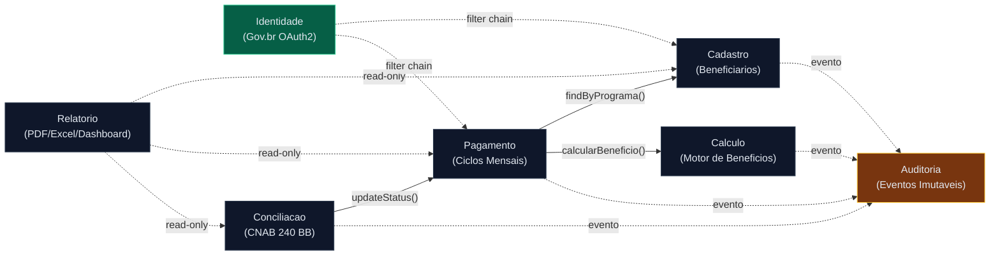

# Bounded Context Map — SIFAP 2.0

## Hypothesis Evaluations

### Cadastro (Beneficiarios + Dependentes) — ACCEPTED
| Criterion | Rating | Evidence |
|---|---|---|
| Cohesion | Alta | CADBENEF, CADDEPEND, VALBENEF, VALDOCS operam exclusivamente sobre DDM BENEFICIARIO (FNR 150). CRUD + validacao de um unico agregado |
| Coupling | Baixo | Nenhum programa de cadastro chama programas de outro dominio. Dependencia e apenas de dados lidos por outros contextos |
| Change frequency | Baixa | Cadastro e estavel — ultimas alteracoes significativas em 2015 (campos IP, email, hash) |

### Calculo — ACCEPTED
| Criterion | Rating | Evidence |
|---|---|---|
| Cohesion | Alta | CALCBENF (4800 linhas) e CALCDSCT sao focados exclusivamente em computar valores. Formula composta com 4 fatores + 8 tipos de desconto |
| Coupling | Medio | Le BENEFICIARIO e PROGRAMA-SOCIAL (read-only). Nao grava — apenas retorna valores calculados |
| Change frequency | Media | Regras de calculo mudam por decreto/legislacao (reajustes anuais, novos programas sociais) |

### Pagamento — ACCEPTED
| Criterion | Rating | Evidence |
|---|---|---|
| Cohesion | Alta | BATCHPGT e o God Batch que gera ciclos de pagamento. DDM PAGAMENTO (FNR 152) e exclusivo deste dominio |
| Coupling | Alto (legado) → Medio (moderno) | No legado, BATCHPGT faz cadastro+calculo+pagamento inline. Na modernizacao, pagamento CONSOME calculo via interface interna |
| Change frequency | Media | Ciclos mensais, regras de 13o/abono mudam por legislacao |

### Conciliacao — ACCEPTED
| Criterion | Rating | Evidence |
|---|---|---|
| Cohesion | Alta | BATCHCON e focado exclusivamente em reconciliar retornos CNAB 240 do BB com pagamentos SIFAP |
| Coupling | Baixo | Le PAGAMENTO (para comparar), grava status de volta. Interface com sistema externo (Banco do Brasil) |
| Change frequency | Baixa | Formato CNAB 240 e padrao FEBRABAN estavel. Mudancas raras |

### Relatorio — ACCEPTED
| Criterion | Rating | Evidence |
|---|---|---|
| Cohesion | Alta | BATCHREL, RELPGT, RELAUDIT sao read-only — apenas consultam dados e geram saidas formatadas |
| Coupling | Baixo | Apenas leitura de todos os DDMs. Nao grava nada. Pode rodar em read-replica |
| Change frequency | Baixa | Formatos de relatorio mudam por demanda gerencial, sem impacto no core |

### Auditoria — ACCEPTED
| Criterion | Rating | Evidence |
|---|---|---|
| Cohesion | Alta | DDM AUDITORIA (FNR 153) e append-only. Cross-cutting concern que registra acoes de todos os outros contextos |
| Coupling | Alto (cross-cutting) | Todos os contextos devem emitir eventos de auditoria. Porem, auditoria nao depende de nenhum outro contexto |
| Change frequency | Baixa | Requisitos de auditoria TCU/CGU sao estaveis |

### Identidade (GREENFIELD) — ACCEPTED
| Criterion | Rating | Evidence |
|---|---|---|
| Cohesion | Alta | Autenticacao (Gov.br OAuth2), autorizacao (roles/permissions), gestao de perfis. Dominio coeso e bem delimitado |
| Coupling | Baixo | Todos os contextos dependem dele para authz, mas via Spring Security (cross-cutting, nao acoplamento direto) |
| Change frequency | Baixa | Integracao Gov.br e estavel apos configuracao inicial |

---

## Final Bounded Contexts

### 1. Cadastro (`cadastro`)
- **Responsibility:** Gerenciar o ciclo de vida de beneficiarios e seus dependentes — criacao, validacao (CPF modulo-11, documentos), atualizacao, suspensao e cancelamento
- **Owned data:** Schema `cadastro` — tabelas `beneficiario`, `dependente`, `endereco`, `documento`
- **Public interface:** `BeneficiarioService.findById()`, `BeneficiarioService.findByPrograma()`, `BeneficiarioService.register()`, `BeneficiarioService.updateStatus()`
- **Why its own context:** Agregado raiz (Beneficiario + Dependentes) coeso e independente. Base para todos os outros contextos. Programas legados dedicados (CADBENEF, CADDEPEND, VALBENEF, VALDOCS)

### 2. Calculo (`calculo`)
- **Responsibility:** Computar valores de beneficios usando a formula composta (4 fatores + reajuste), calcular descontos (8 tipos com cap 30% para nao-judiciais), e regras especiais de dezembro (13o salario, abono natalino 15%)
- **Owned data:** Schema `calculo` — tabelas `fator_regional` (27 regioes), `faixa_renda` (5 faixas), `tipo_desconto` (8 tipos), `parametro_calculo`
- **Public interface:** `CalculoService.calcularBeneficio(beneficiarioId, programaId, competencia)`, `DescontoService.calcularDescontos(beneficiarioId, valorBruto)`
- **Why its own context:** Core domain — regras de negocio mais complexas e valiosas. Muda por decreto/legislacao. Motor de calculo de 4800 linhas no legado. Externaliza tabelas hardcoded

### 3. Pagamento (`pagamento`)
- **Responsibility:** Gerar ciclos mensais de pagamento, criar registros individuais para beneficiarios ativos, aplicar descontos, e gerenciar o ciclo de vida do pagamento (pendente → processado → pago/devolvido/erro)
- **Owned data:** Schema `pagamento` — tabelas `ciclo_pagamento`, `pagamento`, `pagamento_desconto`
- **Public interface:** `CicloService.gerarCiclo(competencia)`, `PagamentoService.findByCiclo()`, `PagamentoService.updateStatus()`
- **Why its own context:** Decomposicao do God Batch (BATCHPGT). Volume critico (~4.2M registros/mes). Precisa de chunk processing com idempotencia (Spring Batch)

### 4. Conciliacao (`conciliacao`)
- **Responsibility:** Receber retornos CNAB 240 do Banco do Brasil, reconciliar com pagamentos gerados, aplicar transicoes de status (00→Pago, 01→Devolvido, 02→Erro), e registrar divergencias
- **Owned data:** Schema `conciliacao` — tabelas `arquivo_retorno`, `item_conciliacao`, `divergencia`
- **Public interface:** `ConciliacaoService.processarRetorno(arquivoCnab)`, `ConciliacaoService.findDivergencias(cicloId)`
- **Why its own context:** Anti-corruption layer para formato externo (CNAB 240). Interface com sistema bancario. Tolerancia de R$0.01. Isolado do core domain

### 5. Relatorio (`relatorio`)
- **Responsibility:** Gerar relatorios gerenciais e de auditoria — consolidados por programa, regiao, status. Substituir formato 132 colunas por PDF/Excel/dashboard
- **Owned data:** Schema `relatorio` — tabelas `relatorio_gerado`, `template_relatorio` (metadados apenas — dados vem dos outros schemas via read)
- **Public interface:** `RelatorioService.gerar(tipo, filtros)`, `RelatorioService.exportar(formato)`
- **Why its own context:** Read-only — pode rodar em read-replica sem impactar o transacional. Mudancas nao afetam o core domain. Oportunidade para Strangler Fig em paralelo

### 6. Auditoria (`auditoria`)
- **Responsibility:** Registrar trilha de auditoria imutavel de todas as operacoes do sistema — quem fez o que, quando, estado anterior e posterior
- **Owned data:** Schema `auditoria` — tabelas `evento_auditoria` (append-only, nunca DELETE)
- **Public interface:** `AuditoriaService.registrar(evento)`, `AuditoriaService.consultar(filtros)` — interface event-driven (todos os contextos emitem eventos)
- **Why its own context:** Cross-cutting concern mas com dados proprios (DDM AUDITORIA FNR 153 no legado). Append-only facilita isolamento. Nunca implementado de verdade no legado — oportunidade greenfield

### 7. Identidade (`identidade`)
- **Responsibility:** Autenticacao via Gov.br (OAuth2/OIDC), mapeamento de claims para roles SIFAP, gestao de permissoes por perfil (OPERADOR, AUDITOR, GESTOR, ADMIN)
- **Owned data:** Schema `identidade` — tabelas `usuario_perfil`, `permissao`, `sessao`
- **Public interface:** Spring Security filter chain — transparente para os outros contextos via `@PreAuthorize`
- **Why its own context:** Greenfield — legado usa Natural Security (incompativel). Dominio coeso (authN + authZ). ADR-003 define a abordagem

---

## Inter-Context Communication

| From | To | Mechanism | Data |
|---|---|---|---|
| Pagamento | Cadastro | Interface Java (sync read) | `BeneficiarioService.findByPrograma(status=ATIVO)` |
| Pagamento | Calculo | Interface Java (sync call) | `CalculoService.calcularBeneficio(beneficiarioId, programaId, competencia)` |
| Conciliacao | Pagamento | Interface Java (sync read/write) | `PagamentoService.findByCiclo()`, `PagamentoService.updateStatus()` |
| Relatorio | Cadastro, Pagamento, Conciliacao | JDBC read-only (read-replica) | SELECT direto nos schemas (query otimizada) |
| Todos | Auditoria | Eventos internos (Spring Events) | `AuditoriaService.registrar(evento)` — assincrono, fire-and-forget |
| Identidade | Todos | Spring Security filter chain | `SecurityContext` com roles — transparente |

---
**Definition of Done reminder:** Hypotheses evaluated, rejections documented, 2-5 contexts named, Mermaid renders. ✅ 7 contexts definidos (5 do legado + 2 greenfield), todas as hipoteses aceitas com evidencias.
